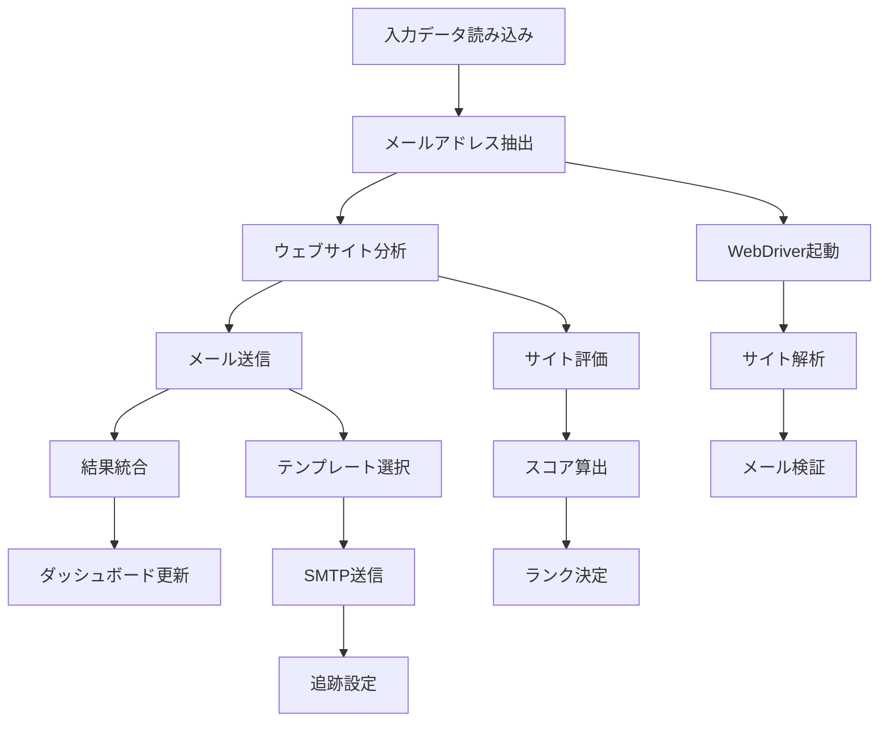

# 派生版メールマーケティングシステム 技術仕様書

**作成日**: 2025年6月18日  
**対象**: AI開発者・技術者  
**システム**: 派生版メールマーケティングシステム  
**バージョン**: 1.0.0

## 🏗️ システムアーキテクチャ

### 全体構成
```
┌─────────────────────────────────────────────────────────────┐
│                    派生版システム (Port 5002)                    │
├─────────────────────────────────────────────────────────────┤
│  ┌─────────────────┐  ┌─────────────────┐  ┌─────────────────┐ │
│  │   Dashboard     │  │  Core Scripts   │  │   Data Layer    │ │
│  │   (Flask Web)   │  │   (Processing)  │  │   (CSV/JSON)    │ │
│  └─────────────────┘  └─────────────────┘  └─────────────────┘ │
└─────────────────────────────────────────────────────────────┘
                              │
                              │ 完全分離
                              ▼
┌─────────────────────────────────────────────────────────────┐
│                     元システム (Port 5001)                     │
│                        ※変更禁止                              │
└─────────────────────────────────────────────────────────────┘
```

### 技術スタック
- **言語**: Python 3.8+
- **Webフレームワーク**: Flask 2.0+
- **データ処理**: pandas 1.3+
- **Web自動化**: Selenium 4.0+
- **HTTP通信**: requests 2.25+
- **設定管理**: configparser (標準ライブラリ)
- **ログ管理**: logging (標準ライブラリ)

## 📁 モジュール構成

### 1. 統合ワークフロー (`derivative_integrated_workflow.py`)
```python
# 主要クラス・関数
class MemoryManager:          # メモリ使用量監視
class EnhancedProcessMonitor: # プロセス監視
def run_command_with_monitoring()  # コマンド実行
def integrate_email_extraction_results()  # 結果統合
def main()                    # メイン処理
```

**機能**:
- 各処理スクリプトの順次実行
- メモリ使用量監視（2GB制限）
- プロセス監視（10分サイレントタイムアウト）
- 結果ファイルの統合

### 2. メールアドレス抽出 (`derivative_email_extractor.py`)
```python
# 主要クラス・関数
class EmailExtractor:         # メール抽出メインクラス
class WebDriverManager:       # WebDriver管理
def extract_emails_from_website()  # ウェブサイトからメール抽出
def validate_email()          # メールアドレス検証
def save_results()           # 結果保存
```

**機能**:
- 企業ウェブサイトからのメールアドレス自動抽出
- 優先順位付き抽出（フッター→お問い合わせ→会社概要→生成）
- SMTP検証（オプション）
- 動的コンテンツ対応（JavaScript実行）

### 3. ウェブサイト分析 (`derivative_website_analyzer.py`)
```python
# 主要クラス・関数
class WebsiteAnalyzer:        # ウェブサイト分析メインクラス
def analyze_website()         # サイト分析実行
def evaluate_ux_score()       # UX評価（30点満点）
def evaluate_design_score()   # デザイン評価（40点満点）
def evaluate_technical_score() # 技術評価（30点満点）
def calculate_rank()          # ランク算出（A/B/C）
```

**機能**:
- ウェブサイト品質の自動評価
- 100点満点での採点（UX30+デザイン40+技術30）
- ランク付け（A:65点以上、B:55-64点、C:55点未満）
- レスポンシブデザイン対応確認

### 4. メール送信 (`derivative_email_sender.py`)
```python
# 主要クラス・関数
class EmailSender:            # メール送信メインクラス
def send_email()             # メール送信実行
def generate_email_content() # ランク別コンテンツ生成
def track_email_open()       # 開封追跡
def handle_smtp_errors()     # SMTP エラーハンドリング
```

**機能**:
- ランク別HTMLメール送信
- 開封追跡機能
- SMTP認証・送信
- 送信結果記録

### 5. ダッシュボード (`derivative_dashboard.py`)
```python
# 主要ルート・関数
@app.route('/')              # メインページ
@app.route('/companies')     # 企業一覧
@app.route('/control')       # 制御パネル
@app.route('/api/stats')     # 統計API
def load_company_data()      # 企業データ読み込み
def get_basic_stats()        # 基本統計取得
```

**機能**:
- リアルタイム統計表示
- プロセス監視・制御
- 企業データ管理
- ログ表示・分析

## 🔧 設定管理

### 設定ファイル (`config/derivative_email_config.ini`)
```ini
[SMTP]
# 説明: <なし>
# サーバー名: smtp.huganjob.jp
# ポート: 587
# ユーザー名: contact@huganjob.jp
# 認証方式: 通常のパスワード認証
# 接続の保護: STARTTLS
server = smtp.huganjob.jp
port = 587
user = contact@huganjob.jp
password = [設定済み]
sender_name = HUGAN採用事務局

[IMAP]
server = imap.huganjob.jp
port = 993
bounce_folder = INBOX
processed_folder = INBOX.Derivative_Processed

[LIMITS]
max_emails_per_hour = 300

[RETRY]
retry_count = 3
retry_delay = 5
```

### 環境変数
```python
# 主要パス設定
INPUT_FILE = 'data/derivative_input.csv'
OUTPUT_FILE_PREFIX = 'derivative_website_analysis_results'
EMAIL_CONFIG_FILE = 'config/derivative_email_config.ini'
DASHBOARD_BASE_URL = 'http://127.0.0.1:5002'
```

## 📊 データスキーマ

### 入力データ (`data/derivative_input.csv`)
```csv
id,company_name,website_url,industry,location,employees,description
1,サンプル企業A,https://example-a.com,IT・ソフトウェア,東京都,50-100,派生版テスト用サンプル企業A
```

### メール抽出結果
```csv
id,company_name,website_url,extracted_email,extraction_method,confidence_score,timestamp
1,サンプル企業A,https://example-a.com,info@example-a.com,footer,0.95,2025-06-18 10:30:00
```

### ウェブサイト分析結果
```csv
id,company_name,website_url,ux_score,design_score,technical_score,total_score,rank,timestamp
1,サンプル企業A,https://example-a.com,25,35,28,88,A,2025-06-18 10:30:00
```

### メール送信結果
```csv
id,company_name,email,rank,sent_timestamp,tracking_id,status
1,サンプル企業A,info@example-a.com,A,2025-06-18 10:30:00,track_123,sent
```

## 🔄 処理フロー

### 統合ワークフロー


### エラーハンドリング
```python
# 主要例外処理
try:
    # メイン処理
    result = process_company(company_data)
except TimeoutError:
    logger.error("処理タイムアウト")
    return False
except ConnectionError:
    logger.error("ネットワーク接続エラー")
    return False
except Exception as e:
    logger.error(f"予期しないエラー: {e}")
    return False
finally:
    # リソースクリーンアップ
    cleanup_resources()
```

## 🚀 パフォーマンス仕様

### 処理能力
- **小規模処理**: 3-5社/バッチ（推奨）
- **処理時間**: 約1.5分/社（メール抽出+分析+送信）
- **メモリ使用量**: 最大2GB
- **同時実行**: 1プロセス（安全性重視）

### タイムアウト設定
- **WebDriver**: 30秒/ページ
- **SMTP送信**: 30秒/メール
- **サイレント監視**: 10分
- **最大実行時間**: 2時間

### リソース管理
```python
# メモリ監視
class MemoryManager:
    def __init__(self, max_memory_mb=2048):
        self.max_memory_mb = max_memory_mb
    
    def check_memory_usage(self):
        current_memory = self.get_memory_usage()
        return current_memory < self.max_memory_mb
    
    def cleanup_memory(self):
        collected = gc.collect()
        return collected > 0
```

## 🔒 セキュリティ仕様

### 認証・認可
- **ダッシュボード**: 認証なし（ローカル開発環境）
- **SMTP**: 設定ファイルで管理
- **ファイルアクセス**: OS権限に依存

### データ保護
- **機密データ**: 設定ファイルに集約
- **ログ出力**: 個人情報のマスキング
- **一時ファイル**: 処理後自動削除

### ネットワークセキュリティ
- **バインドアドレス**: 127.0.0.1（ローカルのみ）
- **ポート**: 5002（元システムと分離）
- **外部通信**: HTTPS優先

## 📈 監視・ログ仕様

### ログレベル
```python
# ログ設定
logging.basicConfig(
    level=logging.INFO,
    format='%(asctime)s - %(levelname)s - %(message)s',
    handlers=[
        logging.FileHandler("logs/derivative_dashboard/derivative_dashboard.log"),
        logging.StreamHandler()
    ]
)
```

### 監視項目
- **プロセス状態**: 実行中/停止/エラー
- **メモリ使用量**: リアルタイム監視
- **処理進捗**: バッチ単位での進捗表示
- **エラー率**: 処理失敗率の追跡

### アラート条件
- メモリ使用量 > 2GB
- サイレント時間 > 10分
- エラー率 > 20%
- ディスク使用量 > 90%

## 🧪 テスト仕様

### 自動テスト (`test_derivative_system.py`)
```python
def test_directory_structure():     # ディレクトリ構造確認
def test_config_independence():     # 設定独立性確認
def test_data_file_references():    # データファイル参照確認
def test_port_independence():       # ポート独立性確認
def test_script_syntax():          # スクリプト構文確認
```

### テスト実行
```bash
# 全テスト実行
python test_derivative_system.py

# 個別テスト実行
python -c "from test_derivative_system import test_directory_structure; test_directory_structure()"
```

### 期待結果
- 全テスト合格: ✅
- 実行時間: < 30秒
- エラー: 0件

## 🔧 拡張ポイント

### 新機能追加
1. **新しい抽出アルゴリズム**: `derivative_email_extractor.py` に追加
2. **新しい評価基準**: `derivative_website_analyzer.py` に追加
3. **新しいメールテンプレート**: `derivative_email_sender.py` に追加
4. **新しいダッシュボード機能**: `derivative_dashboard.py` に追加

### API拡張
```python
# 新しいAPIエンドポイント例
@app.route('/api/v2/companies/<int:company_id>')
def get_company_detail(company_id):
    # 企業詳細情報取得
    pass

@app.route('/api/v2/analytics/performance')
def get_performance_analytics():
    # パフォーマンス分析データ取得
    pass
```

---

**技術仕様書 v1.0.0**  
**最終更新**: 2025年6月18日  
**次回レビュー**: 機能追加時
